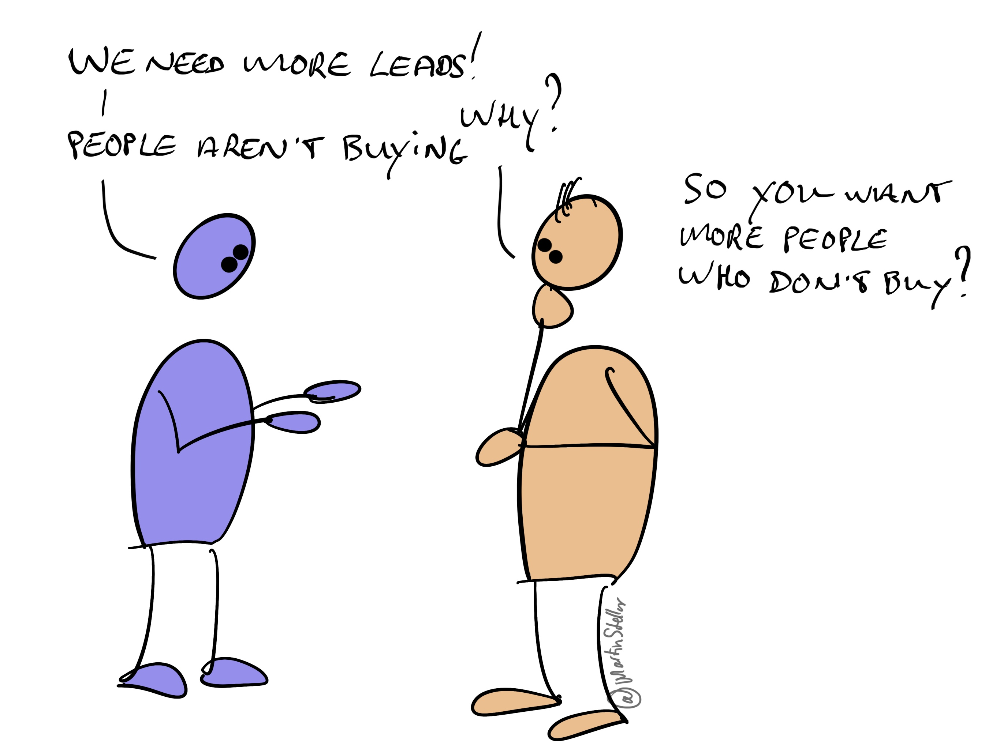

---
tags:
  - Articles
  - LeadGeneration
pubDate: 2024-04-26
type: sfcContent
location: 
cdate: 2024-04-22 Mon
imagePath: Media/SalesFlowCoach.app_Why-you-dont-need-more-leads_MartinStellar.jpeg
---

When you want to increase your sales and your revenue, it's easy to think that you need more people, more opportunities, more leads.

After all, you can't have the clients, if you don't have the buyers. Right?

Maybe.

Because what happens with when you get more buyers to talk to?

You get more people saying no, ghosting you, balking at the price, or saying "We'll get back to you".

And I'm 99% certain that you too already have plenty of people doing that.

But then you get the 'lead generation on auto-pilot!!!' people on LinkedIn, shoving - get this - automated lead gen messages into your DM's.

And yep, what those people do works: if you nag people long enough, hard enough, eventually the numbers game turns in your favour, and you'll sell.

Except, we're back at our original problem: more buyers means spending more time on more failed deals.

Not that the lead-gen crowd cares, of course: they happily exploit the basic human psychological need for hope, and a better future, and that is exactly what they sell. Hope.

But if you want to sell more and earn more, there's smarter ways to do it.

For instance, your number of leads is only 1 of the three main metrics of business growth.

The next one is your conversion rate, and that's followed by the dollar-amount per client: how much people pay you.

Lead generation is nice, but it only brings you more leads. It doesn't make you convert more people, and it doesn't enable you to increase how much you get paid. Those are separate challenges.

So there's an easy choice, if you want more sales and more money:

Either you try and get in front of more people and lose more time...

Or, you work to improve your conversions and your ticket prices, so that you get more sales and money out of the deals you already have.

If the latter is where your mind is at, go ahead and [check this out](https://martinstellar.com/salesbreakthroughsession/).
