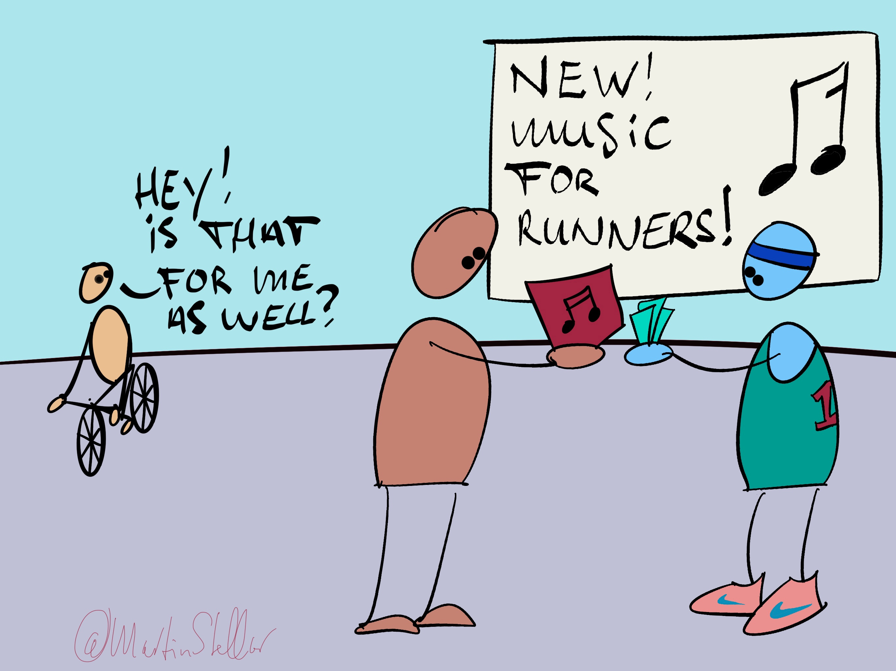

---
tags:
  - Articles
  - Targeting
  - Specificity
  - Prospecting
  - SalesConversations
type: sfcContent
cdate: 2023-03-06 Mon
pubDate: 2023-07-11
imagePath: Media/SalesFlowCoach_Why-you-get-more-buyers-by-appealing-to-fewer-people_MartinStellar.jpg
---

Sure, "The solution for everyone who has problem X" will appeal to everyone who has that problem.

But appealing to someone isn't relevant if that someone doesn't also buy your work, and in fact it can cause you to churn through a lot of time having unproductive meetings with people.

Which means that broadly aimed marketing, positioning and messaging is a mistake.

The "everyone" mentioned above, will on average be less fired up about the solution, than the people who are greeted with:

"The solution for people exactly like you, who have problem X".

With such messaging, lots of people will say: "I'm not like that, so it's not for me".

And that's good.

Because those who *do* recognise themselves in the picture, will say:

"Fantastic. Finally a solution that's just right for me".

So don't be afraid to be explicit about who you're for.

[[📄 More sales? Have fewer conversations|You'll work with a smaller, more engaged set of prospects]], and that means you'll be more efficient in your lead generation and your sales conversations.

Bonus:

Not appealing to certain people in your messaging and targeting, does not mean you exclude them from availing themselves of your help.

Very often, people not in your target group will click with your approach to solving a problem that they too have, and will ask:

"What about me? Will it work for me as well?"

That would never happen if you'd go broad.

Why?

Because the message: "The solution for everyone with problem X" triggers the wrong reaction, where people will exclude themselves:

"That sounds fine, but I'm not like everyone - my problem is different. I'll keep looking for a solution".

Even though the problems people have are typically similar, the message "for everyone" is exactly the wrong message, because every one of us feels that we're unique, and that our problems are unique as well.

So, [[📄 How to make selling easier by looking at your buyer's perspective|speak to that uniqueness]], and you'll see the quality of your pipeline and the conversations you have go up by themselves.