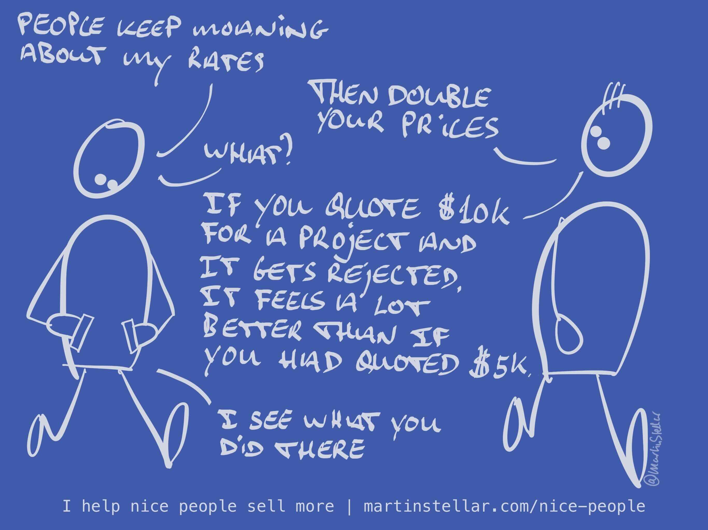

---
tags:
  - Articles
pubDate: 2024-08-23
type: sfcContent
location: 
cdate: 2024-04-23 Tue
imagePath: Media/SalesFlowCoach.app_Why-service-providers-should-feel-proud-and-good-about-charging-high-prices_MartinStellar.jpeg
---

Yes of course, people value things more, when those things come at a high price.

But that's only one of many reasons why quality business services should not be cheap or discounted.

For instance, it's not possible to sell things that are fast, and cheap, and also good.

So if you're selling at low, or discounted, or 'affordable' prices, you're either sacrificing quality, or you're sacrificing speed, and I'll bet your buyers want the best you have, at the fastest pace to success that you can deliver.

Also, high prices are a positioning statement. It says "For the discerning" and it says "For those who really really want it".

Which is a nice filter for your pool of potential buyers, because all the people who don't really **really** want your work, they'll decline and you'll have fewer people to deal with - but all of them will readily accept that you ain't cheap. Which I can tell you from experience, is a very nice type of person to deal with.

And then there's your own subjective experience:

People are going to say no, to high prices and to low prices.

And when you create a nice, affordable, easy-to-decide lowball price... and people decline even that... doesn't that feel awful?

You're doing all you can to make it easy to buy, pricing too low even... and still they say no?

I remember years ago, back when I started out as a copywriter, after my tailoring company went bust.

I started on Upwork, at $8 per hour... and some people would decline.

Fast forward 15 years, and now I get people saying no to $1000 per hour bids, and believe me: that feels a hell of a lot nicer than people saying no to an $8/hr bid.

Anyway: 99% of the people I meet don't charge what their work is worth.

Nearly everyone bases their rates on the time it takes them to do a job, completely ignoring the impact and the value your work brings to a buyer. In other words: what about value-based pricing? What about getting paid commensurate with the change that you make in people's business and life?

I'll bet that sounds nice, to get paid based on the outcomes you deliver, instead of the time it takes.

But how do you get that done?

How do you double your rates?

How do you get people to pay that kind of money?

The details don't fit in an article like this, but generally you double your rates by getting clear on why people should buy in the first place, which people to engage with, what problems they want solved, and getting hyper-specific about your messaging and the way you communicate with your buyers.

But that's generally speaking.

If you want to talk specifics, and enable yourself to raise your rates, maybe even double them, [just get yourself a Sales Breakthrough Session.](https://martinstellar.com/salesbreakthroughsession/)

Cheers,

Martin
