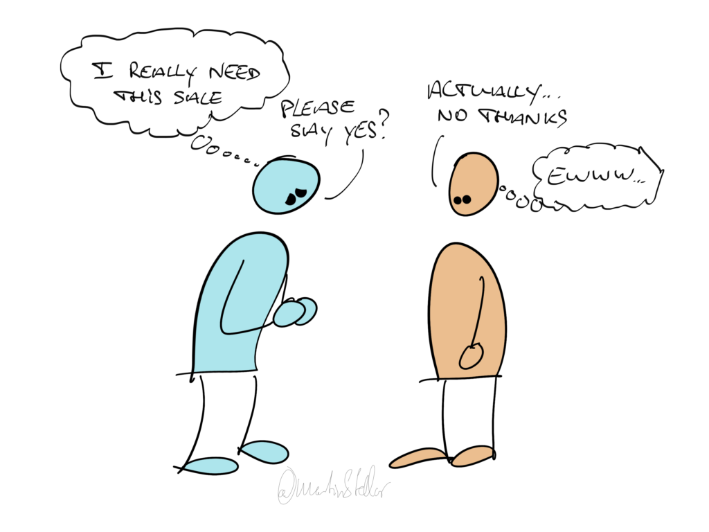

Of course, you'll always have to follow up with buyers, because when a sale happens, it's because of an ongoing conversation. And sometimes, that means you need to reactivate said conversation. 

And then you get: “Hi, I’m just checking in to see if…”

But actually? That's a good idea, but it's bad execution.

Not only because your buyer isn't an airport, but also:

Saying that you’re 'checking in' sends the wrong message. It says: "Please ignore me."

And: using the word ‘just’ isn’t a good idea either, because psychologically, using that word reduces the size of what is probably an important decision for them.

But the real problem is, that you saying you want to check in, [[📄 The worst question, that nearly every seller asks - and what to ask instead|makes it about you]].

It speaks of neediness, and that breaks trust.

Maybe you need that sale, but if they decide to buy, it’s because buying from you is good _for them_.

Checking in says the opposite: it’s good for you. It signals want, and that's the wrong signal to send.

What to do instead?

Ask a direct question, with the intention of helping them.

For example:

“Is there anything you need help with in order to make a decision?”

“Is there any confusion or lack of clarity you’d like me to clear up?”

“Am I correct in assuming that right now might not be the right time for you?”

Or, the powerhouse question: ask for a no.

“I understand this might not be the right time for you - can you let me know that it’s a no for the moment, so we can both move on?”

Very often, asking for a no removes the last objection to buying: the trust and confidence issue.

Asking for a no clearly empowers your buyer, gives them the right to veto, gives them full ownership of the decision, and very importantly:

Asking for a no makes it super clear that you’re not needy.

Bam: more trust.

Also: asking a specific, pointy question can help your buyer to get to a final decision: to move forward and become your client.

So whenever a deal gets stuck, and you want to (re-)connect with your buyer:

Don't 'check in', don't 'follow up', and don't 'circle back'.

Ask your buyer a meaningful, helpful question, the kind where it makes them think, and where the act of answering you is helpful to your buyer. 

