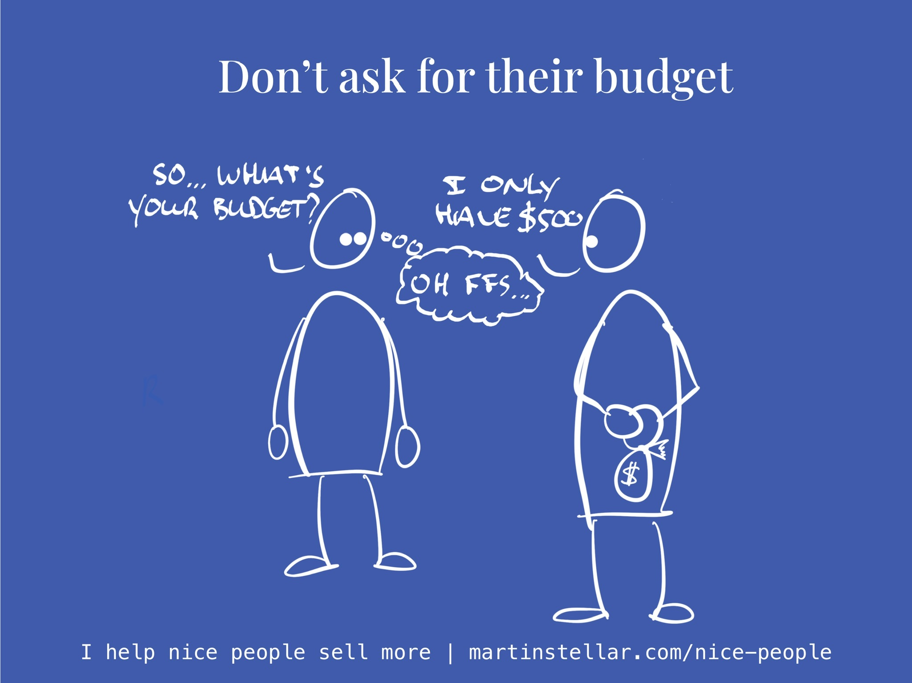

---
tags:
  - Articles
  - Budget
  - MoneyConversation
pubDate: 2024-12-30
type: sfcContent
location: 
cdate: 2024-09-18 Wed
episode: 54
imagePath: Media/SalesFlowCoach.app_Never-ask-a-buyer-for-their-budget_MartinStellar.jpeg

---

There's a whole bunch of reasons why you need to know if your buyer has the money to pay for your work.

After all, if someone doesn't have the funds, engaging in a sales conversation with them is a bad idea.

Which is why typically, a seller will ask: "What's your budget for this?"

On the surface, that seems like a good idea, but there's a number of reasons why it can actually be a terrible idea.

For one thing, it frames the money conversation in terms of [[📄 When a buyer says "Too expensive!" or "I just don't have the money!", show them your ZOG|cost, instead of value]].

And, it can reduce the amount of trust a buyer has, because it can easily be perceived as trying to extract the maximum amount of money from them.

Which is exactly why asking for a budget usually makes a buyer give you a low-ball number.

And that then puts you on lower ground, because now you have to figure out how to have them see that for the solution they need, the cost is going to be higher than what they were (supposedly) expecting.

Next they end up haggling or pushing back and price, and you end up having to make concessions, give discounts, reduce scope or you might even lose the deal.

Instead, figure out the general idea of project scope, as early as you can, and give your buyer a price bracket.

Like this:

"Okay, so you want a high-conversion website, with eCommerce and a member's area, and you need it done in two months or less.

For a project like that, with that timeframe, you're looking at a total between $15.000 and $50.000, depends on the specifics. Is that going to be a problem?"

Now, you've achieved a number of things:

You've taken the lead, that as a seller you should take. And, you've set expectations as to what they can expect your work to be worth.

You've also created a context in which to have your negotiation, and:

You're giving your buyer the option to decline talking further, if that kind of price simply is out of range for them, which means neither of you will waste any time on talking about a deal that isn't going to happen.

Methods like these, that's what you learn in the Sales for Nice People training, [which you can access here](https://martinstellar.com/sales-for-nice-people-info/).

