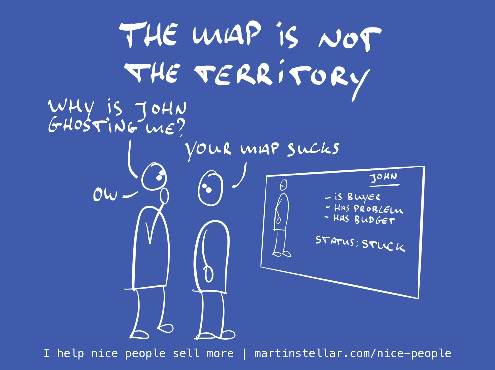

---
tags:
  - Articles
  - Hidden-Sales-Assets
pubDate: 2025-01-03
type: sfcContent
cdate: 2023-11-28 Tue
imagePath: Media/SalesFlowCoach.app_The-map-is-not-the-territory-and-in-sales-that-matters_MartinStellar.jpeg
excerpt: The map is not the territory ~ Alfred Korzybski
optin: false
optinHeader: 
optinBody: 
episode: "45"
---

### "The map is not the territory"
~ Alfred Korzybski

The one thing you must do if you want to improve your sales, and the one thing that will give you the biggest chance of winning a deal:

Get better at creating 'maps' - where a map refers to the level of insight and understanding you have, on your buyer, their goals and challenges, their personality traits and the messaging you need to use with that individual. 

Because the better the quality, and the more detail and resolution that you have in the 'map of your buyer', the more accurately you'll know how to communicate with them, and what to say in order to advance your deal.

Of course when Korzybski coined the statement 'The map is not the territory', he was talking about how words (or maps, or symbols) are not the same thing as the reality (the territory) that those words describe or represent - and back in 1933, I doubt he was thinking about how this applies to selling your work.

But it does, and in fact, you being able to create accurate 'maps' might just be the make-or-break skill that can help you turn more buyers into clients.

Why?

Because a human being simply isn't able to perceive everything there is in reality. Even if we were able to collect all the data there is, on all the things there are, we still wouldn't be able to *perceive* everything there is, because there's just too much of it. I mean, have you ever looked out at the night sky? Yeah, good luck trying to perceive 'everything'.

But human beings have a very handy skill that has enabled us to make our way through this enormously large world, despite the fact that we only know and perceive a fraction of it:

We make maps. We make mental representations. We abstract away all kinds of detail, we mentally stylise things until there's a handy, portable proxy, of the thing we know or the thing we have perceived. Put differently: we use heuristics, and they're pretty helpful in keeping us advancing and surviving.

Heuristics are absolute murder for your sales though, because maps and heuristics automatically exclude details and information, and in many, many of the cases when you lose a deal, it's because there was a crucial bit of information that wasn't included in your map of the buyer.

That adwords client that's looking to hire you and has a $30.000 monthly advertising budget... where did they go? Everything was discussed and confirmed and agreed and you were going to get paid weeks ago... and now they'er not even replying? What the hell is that all about?

Well, maybe there was something you didn't know. Sure, maybe John there is super keen to get started, but he can't get the sign-off from Finance, because it just so happens that the son of the Finance Director also works at the company, and he thinks that adwords are rubbish, and because he wants to do content marketing campaigns instead, he keeps talking his dad out of paying you.

Important data. Wasn't in your map. Oops.

This is why I created the Hidden Sales Assets framework: to give you a step-by-step process for identifying the right buyer, figuring out why that person should by from you, and how to communicate with them in a way that has them go "Ok let's do this, how do we get started?"

[This link](https://martinstellar.com/hsa) takes you to the free Hidden Sales Assets checklist, and you'd do well to study it, and implement the steps. Yes it'll take some work, but you'll learn how to create a buyer map of deep resolution, which means you'll talk to the right people, with the right messaging. 

For most sellers, the map is stupidly basic:

"Buyer has problem. Me got solution. You pay me, I go solve." And yes, that map is accurate to a degree. But it's also caveman-like crude, and it is guaranteed to exclude data that could help you close the deal. So, don't be like a neanderthal, but instead study your buyer, learn your people. 

The map is not the territory. Create better maps.

Oh, and if you want to shortcut the process and get a better insight on your buyers and the messaging to use in just one hour, you can [get yourself an HSA Breakthrough session, right here. ](https://martinstellar.com/salesbreakthroughsession/)

