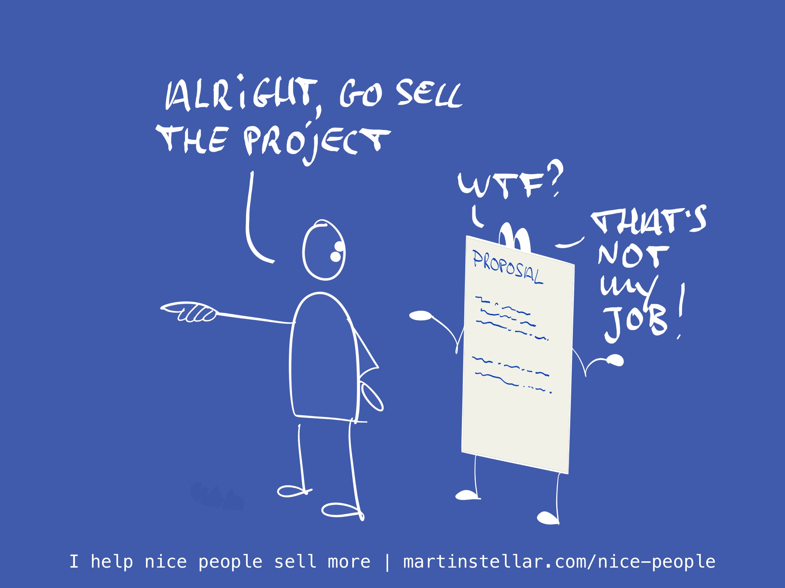

---
tags:
  - Articles
  - Proposals
  - SellingProblems
  - Selling
pubDate: 2024-06-20
type: sfcContent
location: "[[Edinburgh]]"
cdate: 2024-01-15 Mon
imagePath: Media/SalesFlowCoach.app_Why-proposals-fail-to-sell-your-work_MartinStellar.jpeg
docStatus: 
---

Another day, another deal, another proposal shipped off to your buyer.

And your buyer is keen: they like what you proposed, and tomorrow you'll get a reply and a payment or signature, as agreed. Nice, job well done on closing another sale!

Except the next day there's no reply and no payment. A week later and you follow up, but it takes days before you get a reply. And the reply isn't "Paid!" or a signed contract, but something else, something that means your deal is not done, and now you have to go back and figure out what went wrong.

But you don't need to figure that out, because I can tell you what went wrong:

You expected your proposal to do your selling for you.

But your proposal shouldn't do your selling, that's not its job. Selling your work is **your** job.

This is why I usually never even write proposals.

Instead, when the buyer is ready and it's time to turn the conversation into a sale, I ask my buyer to take notes.

We review the needs, the solution, the price and logistics and concerns, and we create an agreement then and there, on the call.

My buyer is taking notes (and me too, of course), and once everything is listed and confirmed and my buyer agrees to buy, I say:

"Perfect, thank you. I'm excited to get started. Next up I'm going to write up my notes in a 1-page agreement for you to review, and I'll send it along with the invoice and payment details. Let me know if you have any questions or concerns."

This is far more effective, far more powerful, than writing a proposal and hoping that it'll seal the deal.

Because a proposal the way it's usually done, is hard work. For you to create, sure, but a bigger problem is that it's hard work for your buyer.

Do you really think a busy CEO is going to enjoy taking hours out of their day, just to review all the intricate details and corporate speak that you stretched out over a 7-page document? Of course not. 

Sending proposals like that means that you're '[[_SalesFlow Coach/📄 Are you selling them a problem? (Pt. 3 - Interaction tax)|selling your buyer a problem]]' and that's exactly what ruins so many deals.

Of course you can't apply my method strictly in all situations. Some sales require a formal proposal, especially when you're selling to a large organisation where there's different departments and stakeholders that need to check your proposals.

In such a case, you have two options: 
You either do your best, and try to write a proposal that's so good that it will sell those people that you haven't met with, and hope for the best...

Or, you make sure you get into a meeting with all the decision-makers in the deal. 

Which might not always be possible (see: Busy CEO etc etc).

So if that's the case, and you have a buyer who wants to buy, but they are not the ultimate decision-maker, tell your buyer this: 

> You probably know that many proposals never get read, and obviously that way the deal won't close. 
And I think it would be a real shame if your company ends up not getting this solution. Especially given how keen you are on getting started. 
So here's a different approach:
I'm happy to write a proposal, but I think you and I should get together for another meeting or two, for us to review it together before you send it on, so that we create a proposal that has the biggest possible chance of being accepted. 
Does that sound helpful?

If your buyer truly wants your work, they are your ambassador in the process, your champion. They'll know a lot of detail about how to convey the proposal in a document, and they'll be highly likely to want to help create a proposal that converts. 

Anyway: never make the mistake of thinking that your proposal will do your selling for you.

First close the sale in a conversation, and next, you use the proposal as a confirmation of what's been discussed and agreed upon.
