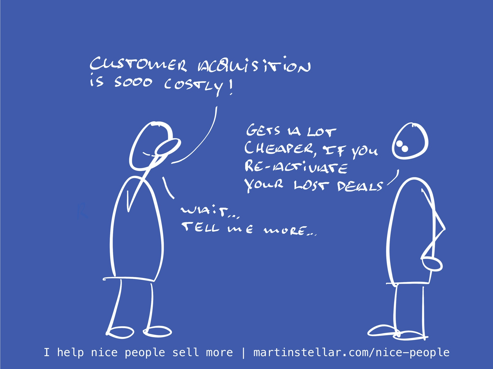

---
tags:
  - Articles
  - Hidden-Sales-Assets
  - Re-activation
pubDate: 2024-08-14
type: sfcContent
location: 
cdate: 2024-08-14 Wed
episode: 
imagePath: Media/SalesFlowCoach.app_Hidden-sales-assets-lost-deals_MartinStellar.jpeg
podStatus: Published
---

Generating opportunities is hard work, isn't it?

SEO, ads, meetings, content marketing... it's a lot, and for each opportunity you pay a price.

And obviously, a lot of people end up not buying.

And there you go, marking yet another deal as 'lost' in your CRM.

Most people then move on, and spend more resources, to drum up new leads.

But smart people will revisit their lost deals regularly, to see which buyers you might be able to reactivate.

After all, you've already paid the cost of generating those opportunities, and you never know who might be in the market for your work at a later stage.

And if you never revisit your lost deals, you will indeed never know.

But if you review the lost deals? Then you might be able to capitalise on money that you've already spent. Then you'll know, if anyone there is in the market.

Sure, generating new leads is necessary, but if that's all you do and you never go back to look at lost deals, you're probably leaving money on the table and you're letting your past investment go to waste. And unless I'm very much mistaken, you've paid a lot of money on that investment.

So have a look at these people, check out their socials, see what's new in their world or business, and get back in touch. You just might be pleasantly surprised.

Cheers,

Martin

P.s. You'll also be pleasantly surprised if you get a Breakthrough Session, because together we can look at your lost deals, and I'll help you create messaging that gets those people back into your calendar for a new opportunity.

Get yourself a BTS, let's [reactivate some of your lost deals.](https://buy.stripe.com/00gg33c2pdjm7EQaEF)