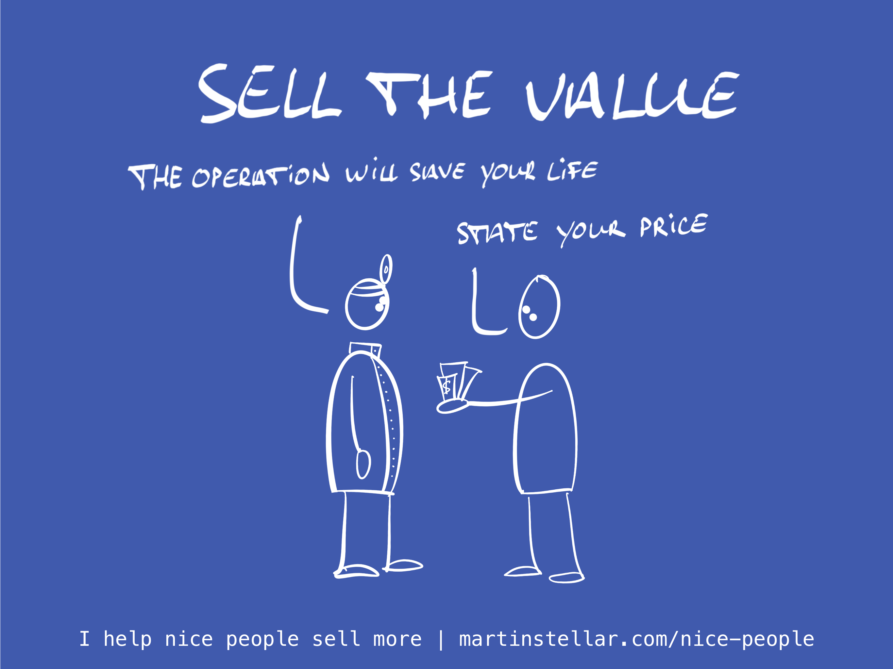

---
tags:
  - Articles
pubDate: 2024-11-05
type: sfcContent
location: 
cdate: 2024-11-05 Tue
episode: 
imagePath: Media/SalesFlowCoach.app_Sell-the-value_MartinStellar.png
---

How would I know? Maybe you and I have never met, and I have no idea what you do or what you charge, so... do I have a crystal ball?

Well no, but I do have 100s and 100s of conversations under my belt, with coaches and consultants and service providers, and I don't know if I ever spoke to anyone who actually charges what their work is worth.

So, you'd be an outlier if you charge what you ought to.

"But Martin, I charge industry-standard rates!"

Right. So you're stuck hitting a ceiling that those in the middle of the bell-curve haven't broken through yet. Sounds fun.

Or maybe you're trying to be affordable?

Right, but are you are aware that 'affordable' is code for 'competing on price', and that's a race to the bottom? Only one can be the cheapest, and you don't want that to be you, and competing on price is misery all the way down.

So what's the solution?

Two options:

First, you need to consider [[📄 Value, impact, and pricing (yes, you're charging too little)|how much value your work creates]]. Because you're not selling hours, or projects, or even outcomes: you're selling value.

And your pricing should be commensurate with the amount of value that your work creates.

Your leadership coaching enables a client to get their operations in shape, and now they are profitable and they qualify for a million-dollar investment round?

Right, that's a lot - A LOT! - of value.

So to charge $40,000 for a year of coaching is laughable, if you consider the fact that even one new hire in your client's company will earn twice or thrice that.

Think in terms of value. Ask yourself how much value you actually create, and, I don't know, start by doubling your fees?

Yes, you'll lose half your clients but you'll earn the same for half the work.

The second option for earning more is working with me. Because I happen to have a knack for getting people to charge more, sell more, and earn more. And if that's what you want, I can help.

Send me an email and [let's talk](mailto:hello@martinstellar.com).
