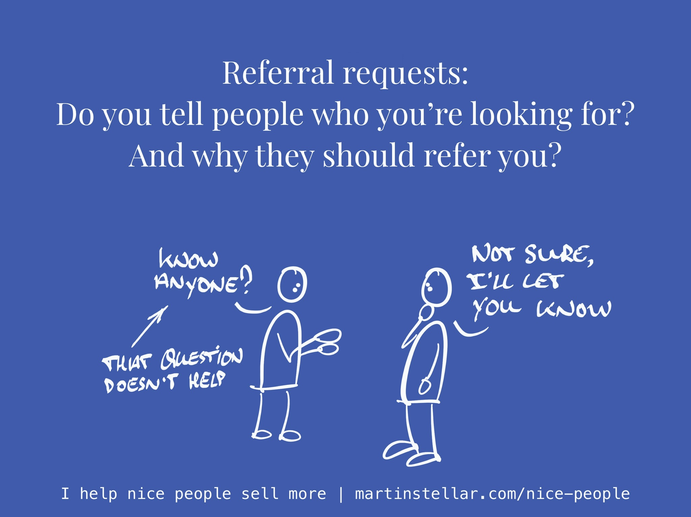

It's fun, when someone who trusts you and respects you introduces you to someone in their network.

It can be highly lucrative too, because a referred buyer arrives with more trust and openness, and is more likely to buy than someone who saw your ad or your content marketing.

And, introductions are a terrific way for getting ROI on all the years you've spent building presence, reputation, and network.

In other words: your network is an asset, which you spent years or even decades building up, and you paid a price for that.

So obviously, if you were to leverage that asset - i.e. generate introductions and referrals - you could get opportunities and sales on time and money you've already spent.

But most business owners ignore the potential there.

Which has a reason, because most referral requests look like this:

"Do you know anyone who might be interested in getting my help?"

Obviously, when you ask it like that, the most likely response will be "I'll let you know", and then nothing happens.

So you ask 2 or 3 people, get no introductions, and most people then give up on the effort, because "I tried, but it didn't work".

Which is a shame, because if you were to ask the right question, in the right way, it becomes far more likely that your request will actually lead to an introduction.

That right question needs to include 3 components:

- The question "Who do you know?", instead of "Do you know anyone?"
- A specific description of exactly the kind of person you're looking to connect with, and very importantly:
- A very concrete definition of why that person would be interested in meeting with you

And no, that definition is not "Because they should buy my work".

Instead, that reason should include your USP, and the Problem-stack that those people that you want to meet live with.

So for those of my readers who have built a valuable network, who are trusted and respected, and who want to generate opportunities by asking for them:

Get yourself a Sales Breakthrough Session, and together we'll create a referral request that will get you introductions, instead of the common "I'll let you know" response.

I'll analyse your USP and Avatar, we'll define the Problem-stack, and together we'll compose a request that makes it extremely easy for your contacts to identify people to introduce you to.

So the question is:

When someone is referred, and they become a client, how much is that client worth?

Is that client worth $295 or more?

In that case, get yourself a Breakthrough Session, because that's only $295.

And as a bonus, you get a month of text-based support (normally $99/mo), so that you can ask me questions 5 days a week about how to turn those referrals into sales.

Think about it:

You've invested in your network for years.

Let's get a return on that investment - let's get you introductions and referrals.

Here's where you can [get your Breakthrough Session. ](https://martinstellar.com/salesbreakthroughsession/)