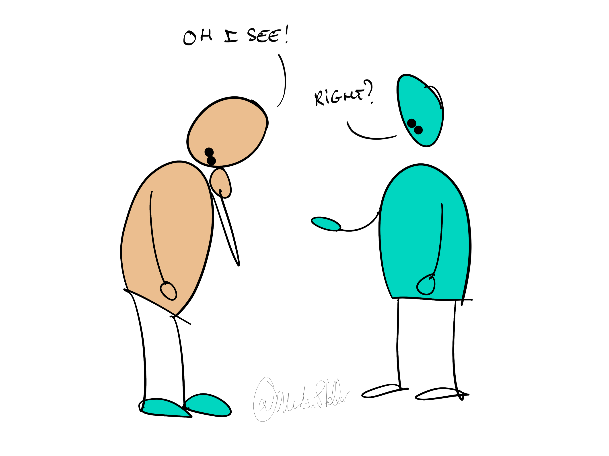

---
tags:
  - Empathy
  - Trainings
pubDate: 2023-09-30
type: sfcContent
cdate: 2023-09-18 Mon
imagePath: Media/SalesFlowCoach.app_Perspective-taking-in-sales_MartinStellar.png
excerpt: How to use empathy and perspective-taking to truly understand your buyers, and get an edge on your competitors
ebf: "true"
---

> [[🏋️ Trainings]] >> The Empathy Edge

### How to use empathy to map out purchase motivators

Knowing what your buyer needs, or would benefit from, is rarely enough to have them buy.

What's required is for you to understand their needs so well, you can express their [[📄 Hidden Sales Assets 3 - Your ideal buyer's Problem-stack|problem-stack]] better than they could.

Do that, and you'll automatically position yourself as the person who is eminently qualified to provide the solution.

To get clarity on that problem-stack, use strategic empathy:

Zoom out and look at the buyer from a global perspective.

Don't fall into the caveman-trap of "you problem, me solution, you give money", because that's the least empathy-based approach you could take.

Instead, ask yourself the questions below. 

In some cases you can ask your buyer directly, in other cases you'll need ask yourself, and answer based on what you've learned about your buyer so far.

Write the questions and answers down, because that's how you visually map out your buyer's reality, and it'll help you find new insights.

**[[😱 What are their three biggest fears?]]**

**[[😫 What's their single biggest frustration that you can remove?]]**

**[[⭐ What are their three biggest wants?]]**

**[[🏆 What is their biggest aspiration?]]**

**[[👤 What change in identity will take place when they buy?]]**