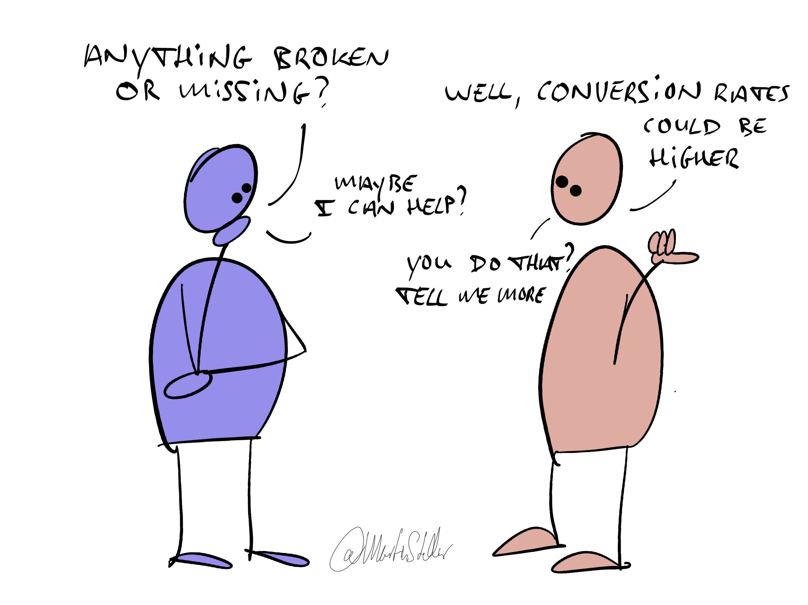

Most people who want to scale up get it wrong.

They think that in order to go from good to great, you need to bring in new customers.

And so ad campaigns get launched, sales teams get hired, webinar funnels get built, marketing consultants are brought in...

Because hey, if we want to scale, we need more. Right?

Sure you need more, but:

What exactly do you need more of?

According to Martin, there's nothing like 'more of what's already working'.

And if 'what works' means that clients buy, and are happy with their purchase, then the 'more' that he looks for, is:

**"More purchases from those same happy clients"**, because:

### Repeat purchases are often the simplest, fastest, cheapest and most lucrative way to start scaling up

After all: they've paid you before, you've solved their problem, and they're happy.

And that means they know you, like you, and they trust that if you did a great job in the past, you'll do a great job again.

And all you need to do in order to generate more sales out of past and current clients, is ask them:

"What's missing or broken in your business?"

You know: a friendly conversation about their problems and challenges.

Not a sales conversation, mind you: just a friendly chat.

In fact:

### You'll always get best results by asking people about their problems, until they ask you about your solution

That's the moment when the sales conversation starts.

And when you go back to your past and current clients, and ask about their problems, you'll undoubtedly find problems that - while they didn't initially come to you for that - you're eminently equipped to solve.

In which case, you can simply ask:

"I might be able to help with that - should we talk about how that would work?"

Done this way, you're letting your buyers tell you what other kind of help they want from you.

Have 20 of those conversations, and you'll have a pretty clear picture of a new product or service that's relevant and desirable to the market that already buys from you.

In other words, you're effectively doing market research.

And, while you're selling your clients on a repeat purchase, you can go and formalise that offer into a formal part of your suite of promises, offerings, and services.

This way, you're adding a product or service, while earning money, and you're doing it with the informed certainty that people actually want to pay for it.

And, you'll be pre-selling the solution, as you go interviewing and researching. Not bad.

### Oh, and if they have a problem they want you to solve, but it's out of your wheelhouse?

Then you introduce a trusted revenue partner, who does the work independently, and pays you a referral fee.

In short:

So long as you rely on your buyer's needs to inform you what to build or add, and you carefully attune and adjust your messaging and promise to those needs, you can scale up without investing a single penny in it.

Beats ad campaigns, if you ask me.

So, if your offer works, your clients are happy, and you've got room for scaling up:

Start by talking to your clients, and ask them:

"What's broken or missing in your business?"

Next up, how to scale up by **[[👨‍🎓 SIBG Pt. 3.2 - Expand by leveraging connections & relational capital|leveraging connections & relational capital.]]**
